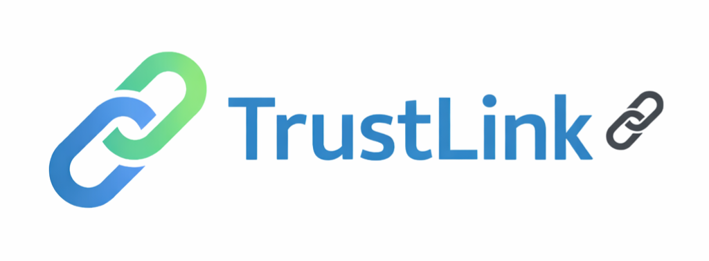

  

A Web3 safety solution for identifying verified tokens across Stellar and XRPL

🚨 Problem
Many wallets contain fake or misleading assets, making it difficult for users to distinguish real tokens.
This creates financial risk and reduces trust in the Web3 ecosystem.

📱 UI Preview

## ✅ Solution
TrustLink provides a simple verification system that allows users to:

- verify token authenticity  
- check official contract or issuer addresses  
- access official project links  
- avoid scams and misleading tokens  

---

🧠 **How It Works**  
Users search by token name, symbol, or address  
TrustLink matches verified data from multiple sources  

---

🏷️ **Verification Levels**  
🔴 Unknown  
🟠 Basic  
🟡 Verified  
🟢 Official  

---

📊 **Trust Score (0–100)**  
90–100 → Safe  
60–80 → Caution  
0–50 → High Risk

